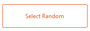
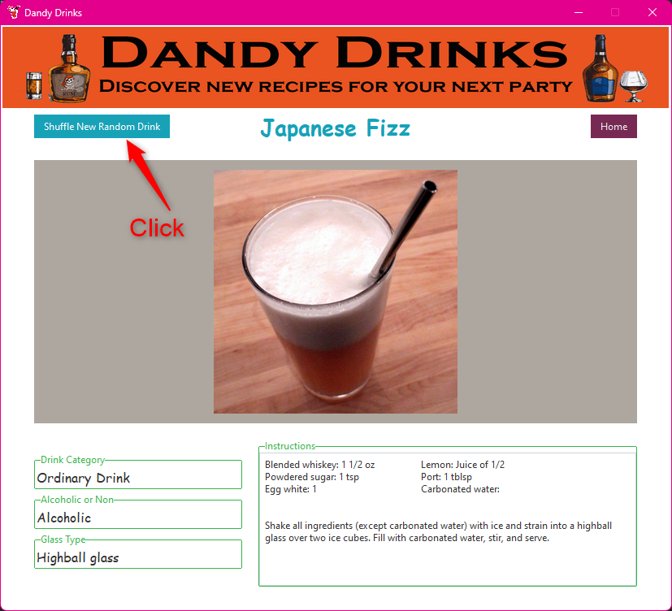
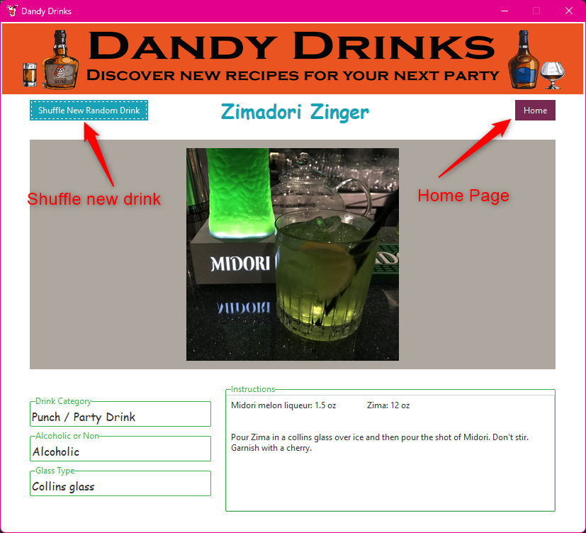

## :bowtie: DANDY DRINKS :bowtie:

### :eyes: About
 Dandy drinks is a desktop application that uses thecocktaildb.com api to create a 
fun application for anything drink related. Generate random drinks, search for drinks 
by glass type, alcohol, alcoholic/non-alcoholic, or any ingredients. 

### :question: Why?
I created this as a beginner lesson in accessing api's, retrieving data and making a fully 
dynamic desktop application with Python and Tkinter. Plus...it has a super cool gif that I 
embedded into the home page. Gif's are neat, and it makes the application feel more webby.

### Lets's Begin:

The application opens to a 'home page' screen with and animated, scrolling GIF at the top,
and four buttons at the bottom of the page labeled as:
- Search By Drink Categories
- Select Random
- Search By First Letter
- Search By Ingredient

### Select Random Button

When clicked, the Select Random button opens a new 'page' in the application that displays a
random drink brought back from the api. 

The random page displays the following information:
- The name of the drink as a title at the top of the page
- A Shuffle New Random Drink Button at the top of the page
- A Home Button at the top of the page
- An image of the drink 
- Fields for:
  - Drink Category
  - Alcoholic or Non-Alcoholic
  - Glass Type
  - Instructions for making the drink including ingredients and measurements

Clicking on the Shuffle New Random Drink Button will return a new random drink.
Clicking on the Home button will return the user to the Home page of the application.

  

# CURRENTLY IN PROGRESS!!

