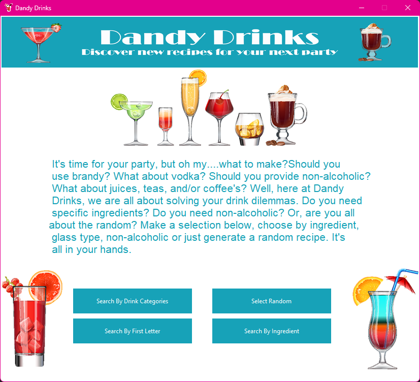
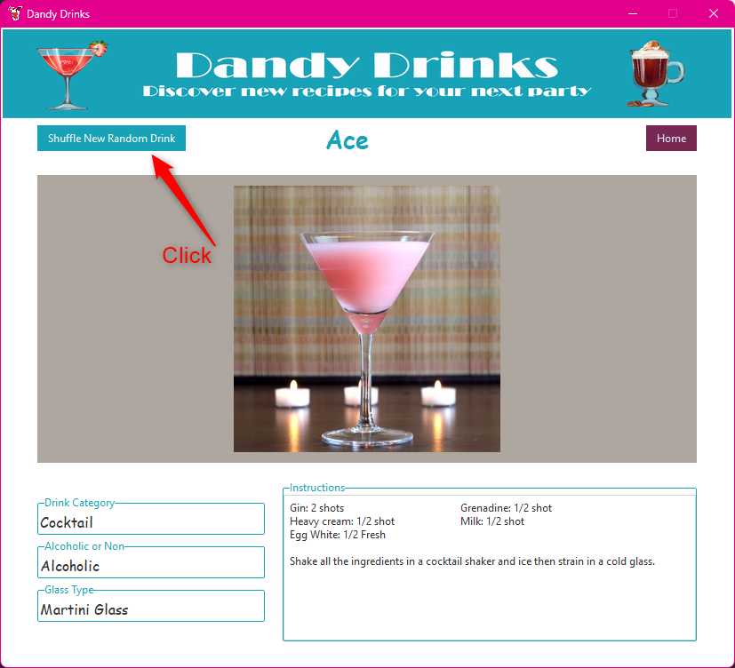
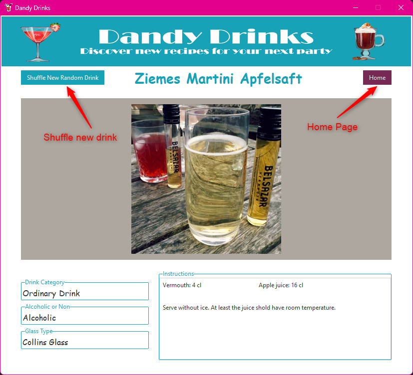

## :wine_glass: DANDY DRINKS :cocktail:

### :eyes: About
 Dandy drinks is a desktop application that uses :tropical_drink: thecocktaildb.com api to create a 
fun application for anything drink related. Generate random drinks :beer:, search for drinks 
by glass type :tumbler_glass:, alcohol :beers:, alcoholic/non-alcoholic :bubble_tea:, or any ingredients. :question: 

### :question: Why?
I created this as a beginner lesson in accessing api's, retrieving data and making a fully 
dynamic desktop application with Python and Tkinter. 

### Lets's Begin:

The application opens to a 'home page' screen with a banner image near the top of the page,
and four buttons at the bottom of the page labeled as:
- :mag: Search By Drink Categories
- :mag: Select Random
- :mag: Search By First Letter
- :mag: Search By Ingredient

### Select Random Button

When clicked, the Select Random button opens a new 'page' in the application that displays a
random drink brought back from the api. 

The random page displays the following information:
- :wine_glass: The name of the drink as a title at the top of the page
- :twisted_rightwards_arrows: A Shuffle New Random Drink Button at the top of the page
- :house: A Home Button at the top of the page
- :tropical_drink: An image of the drink 
- Fields for:
  - Drink Category
  - Alcoholic or Non-Alcoholic
  - Glass Type
  - Instructions for making the drink including ingredients and measurements

Clicking on the :twisted_rightwards_arrows: Shuffle New Random Drink Button will return a new random drink.
Clicking on the :house: Home button will return the user to the Home page of the application.

  

## Additional Notes :ledger:
- :computer: The GUI for this application is made with Tkinter and TTKBootstrap
- :art: The theme used from tkinter is 'United'
- :globe_with_meridians: This is a desktop application, but an internet connection is required to query the api
- :signal_strength: The api is thecocktaildb.com

